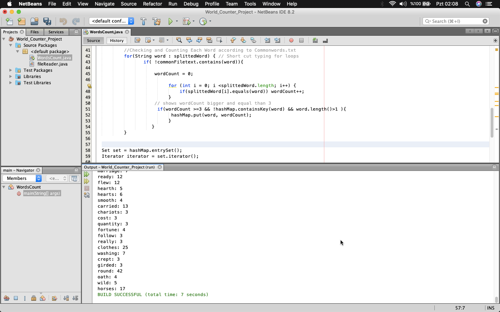

# Word_Counter_Project
* This Java Application is counting each word from textfile and show user. User could pick to show wordCount bigger or equal as well.
* Dropped "Commonwords" to counting
# Screen Image Example

selectted wordCount bigger and equal than 3.

